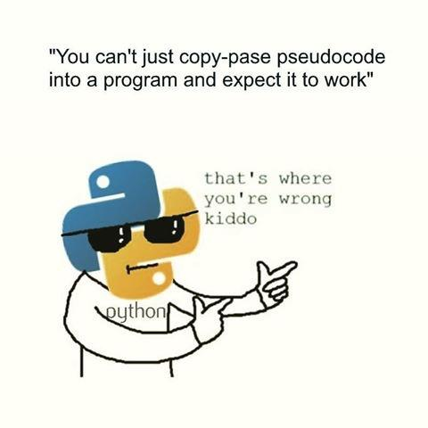

<!-- $theme: default -->
<!-- footer: #python - 04  -->
<!-- $size: 16:9 -->
<!-- page_number: true -->

# Python intro 04



---

# Python 04

Start your VM, open your terminal (`Ctrl+Alt+T`) and try to type the commands shown on screen, we're going to go through:

* lists
* dictionaries
* scripting


---

# lists

Open your terminal (`Ctrl+Alt+T`), then write 

Lists are a compound datatypes often referred to as sequences, most common is `list`. These datatypes contain several elements which are all stored in a separate compartment, each element can be easily accessed, modified or removed. Each element is identified by its position in the list, with the first element being `element_0`, the second one `element_1`.

---

# lists

You can create a list by writing the following command in your python console :

```python
# empty list
>>> my_list = []
>>> my_list
```
`[]` are the symbols associated with a list, the same way `""` are the symbols associated with a string. You could for example write `a = ""` to create an empty string.

---

# lists

To create a list which already contains the integer 1, 2 and 3, you can input :
```python
# list of integers
>>> my_list = [1, 2, 3]
>>> my_list
```
It is possible to mix datatypes within a list, in this case, we are creating a list which contains an integer, a string and a float:
```python
# list with mixed datatypes
>>> my_list = [1, "Hello", 3.4]
>>> my_list
```
Get element of a list (first element is `0`):
```python
>>> my_list[0] 
>>> my_list[1]
>>> my_list[2]
```
<!-- *footer: -->

---

# lists


If you try to get the fourth element of this list, you will get an error message:
```python
>>> my_list = [1, "Hello", 3.4]
>>> my_list[3]
Traceback (most recent call last):
  File "<stdin>", line 1, in <module>
IndexError: list index out of range
```
The error message means that the index you are requiring is out of the range of the list `my_list`, which is true, since this element does not exist.

To add an element to a list, use:
```python
>>> my_list = ['a','b','c','d','e']
>>> my_list.append('f')
>>> my_list
```
---

# lists

You can also modify any element from a list using its index:
```python
# I made a mistake in this list:
>>> my_list = ['a','k','c','d','e']
# change the 1st element    
>>> my_list[1] = "b" 
>>> my_list         
```
Finally, if you want to get the last element of a list, use negative indexing:
```python
>>> my_list = ['a','b','c','d','e']
>>> my_list[-1]
```
To get the one before the last one:
```python
>>> my_list[-2]
```

---

# dictionaries

You can see dictonaries as lists with uniques keys that will lead to a value or element. 
A list can be seen as a kind of dictionary where the key to call the value of each element is the position of this element in the list.
For dictionaries, each element is identified by a unique string, called a key, `key: value`.

```python
# empty dictionary
>>> my_dict = {}
>>> my_dict
# dictionary with integer keys
>>> my_dict = {1: 'apple', 2: 'potato'}
>>> my_dict
```
---

# dictionaries

In the previous example, integers were used as keys for the dictionary. The dictionary contains two different element, the first element's key is `1` and its value is `apple`.
To retrieve the value of the element associated with the key `1`, we can write:
```python
# get element of dict using key
>>> my_dict[1]
```
Instead of integers, strings are usually employed:
```python
# dict with string keys
>>> my_dict = {'fruit': 'apple', 'vegetable': 'potato'}
>>> my_dict['vegetable']
```
---

# dictionaries

We can again, go update any value using its key:
Update/add items to dicts:
```python
>>> my_dict = {'fruit': 'apple', 'vegetable': 'potato'}

# update value
>>> my_dict['vegetable'] = 'aspargus'
>>> my_dict
```
We can also add new elements to our dictionary:
```python
# add item
>>> my_dict['meat'] = 'beef'  
>>> my_dict
```

---

# len

Get length of a list or dictionary:
```python
>>> my_list = ['a','b','c','d','e']
>>> len(my_list)
>>> my_dict = {'fruit': 'apple', 'vegetable': 'potato'}
>>> len(my_dict)
```


---

# Scripting

Open a terminal, you should be in your `home` directory, the prompt shoud look like this:
`ilyass@tx1~$ `
* `ilyass` is the user, 
* `tx1` is the name of the machine, 
* `~` means that we are in our home folder, 
* `$` means that you are a normal user

Let's create a folder:
`ilyass@tx1~$ mkdir Exercises` *(mkdir: make directory)*
Check the folder was created:
`ilyass@tx1~$ ls` *(ls: shows file/folders in current directory)*
Enter the folder:
`ilyass@tx1~$ cd Exercies` *(cd: change directory)*

---

# Scripting

Notice how the terminal prompt changed to reflect the director we are in:
`ilyass@tx1~/Exercises$` 
We are now going to write a python script in this folder. We will be using `atom`.
First, let's get `atom`. We can install software using the `apt-get` command:
`ilyass@tx1~/Exercises$ sudo snap install atom --classic`
* `sudo` means that we need admin privileges to execute this command
* `snap`: simple installation and update management (like an appstore, `apt-get` is the most popular one)
* `install` we want `snap` to use the `install` function
* `atom` it is the software we want to install
* `--classic` is because `atom` install uses the classic version of snap
---

# Scripting

Now that we have `atom`, simply write:
`ilyass@tx1~/Exercises$ atom .` 
Use `New File` to create an empty file, write a few words in it and save it as `temp.py`
Paste the following content in the file:
```
print("Hello world !")
```
Save, then go back to the terminal and input:
```
ilyass@tx1~/Exercises$ python3 temp.py
```
The file will now execute and should print `Hello world !`

**Exercise :** Write your own "Hello world !" script.

---


